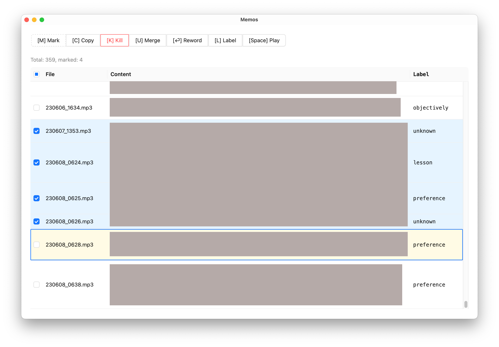

# Memos

Screenshot:



## How to

### Run the app with hot reloading

```bash
yarn tauri dev
```

### Upgrade Deno

```bash
deno upgrade
```

(NB: don't use the Brew version.)

### Import memos into the database

```bash
deno run -A import-memos/index.ts
```

### Add a Rust dep

```bash
cd src-tauri
cargo add ...
```
